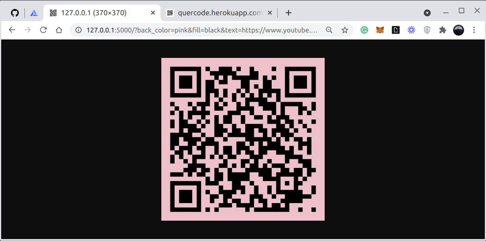
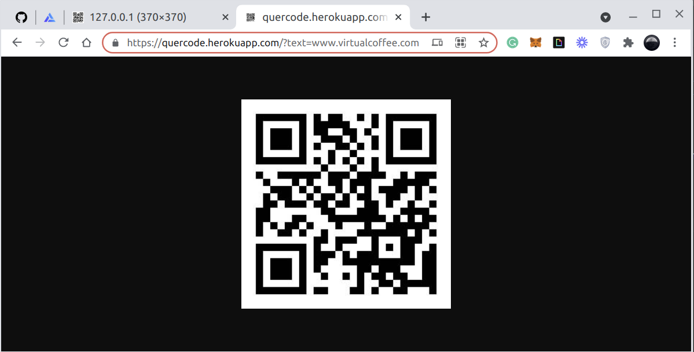
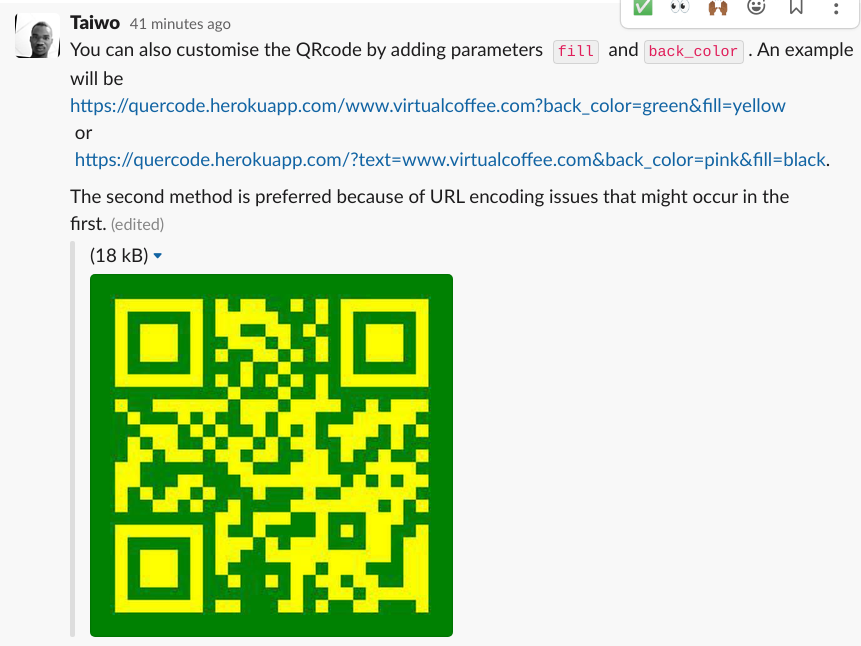

# QueRcode (kyew-ar-kode)

## A simple,customisable and fast online QRcode generator.

If you have ever felt like you need a simple qrcode generator that works without any fuss, this is the project for you. 
All you need to do is attach the string to the main URL of the code as a parameter in the format `{URL}/?text={Text-To-Be_QR-Coded}` . 

For example
`http://127.0.0.1:5000/?text=www.google.com.ng` or `https://quercode.herokuapp.com/?text=www.google.com.ng`.

**Note:** `https://quercode.herokuapp.com/` is an hosted version of this code. It is free and open for everyone. You don't have to host any code yourself.

## Screenshots

  
It even renders in Slack chats. 

## Built With

- [Python](https://www.python.org/)
- [Flask](https://flask.palletsprojects.com/en/2.0.x/)
- [QR-code](https://pypi.org/project/qrcode/)

## Features

- Available online.
- Easy to use.
- Customizable fill and background color
- Very fast.
- Low Size.
- Renders everywhere. Literally everywhere.

## Example Code
To simply generate a QR-code for a text, say `youtube.com/watch?v=dQw4w9WgXcQ`, all you have to do is
  
`http://127.0.0.1:5000/?text=youtube.com/watch?v=dQw4w9WgXcQ`  
or if you are using the hosted version  
`https://quercode.herokuapp.com/?text=youtube.com/watch?v=dQw4w9WgXcQ`. 

The result would be  

 

To customize the image for another text `taiwodevlab.hashnode.dev`, you simply add the query parameters `fill` and `back_color`. 
`http://127.0.0.1:5000/?text=taiwodevlab.hashnode.dev/&back_color=pink&fill=black`  
or if you are using the hosted version  
`https://quercode.herokuapp.com/?text=taiwodevlab.hashnode.dev/&back_color=pink&fill=black`.

The result would be  

## Contributing

Issues and pull requests are welcome at [flask-qrcode-generator](https://github.com/teezzan/flask-qrcode-generator). This project is intended to be safe, welcoming, and open for collaboration. Users are expected to adhere to the [Contributor Covenant code of conduct](https://www.contributor-covenant.org/version/2/0/code_of_conduct/). We are all human.

## Authors

**[Taiwo Yusuf](https://github.com/teezzan/)**

## Acknowledgments

**[Meg Gutshall](https://github.com/meg-gutshall/)** for her README template. Helped a lot.

## License
This project is licensed under the MIT License - see the [LICENSE.md](LICENSE.md) file for details.